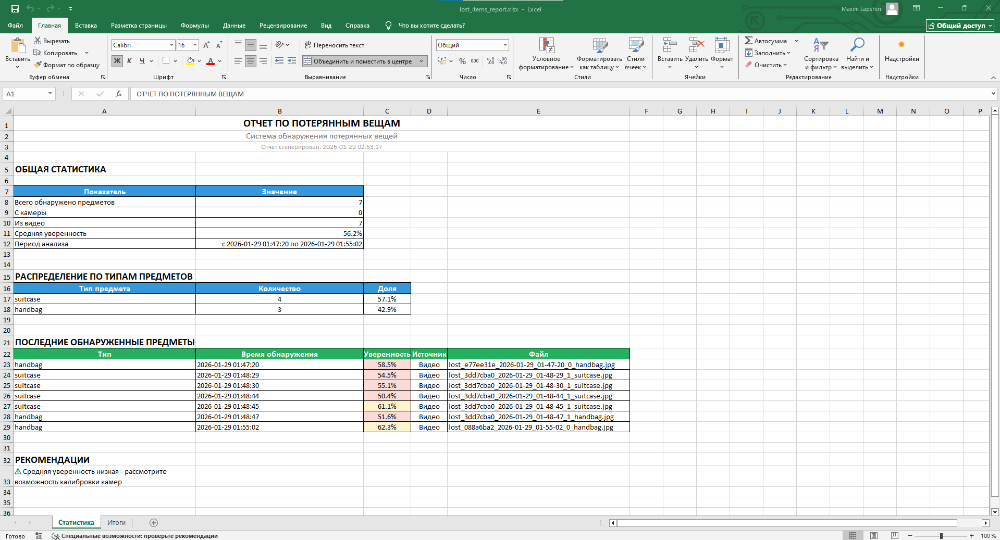
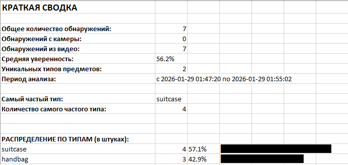

# Система обнаружения потерянных вещей (Поиск забытых рюкзаков в аэропорту)

[](https://www.python.org/)
[](https://flask.palletsprojects.com/)
[](https://github.com/ultralytics/ultralytics)
[](https://opencv.org/)

**AI-система для автоматического обнаружения оставленных сумок, рюкзаков и чемоданов в видеопотоке и на видеофайлах**

---

## 📋 Содержание

- [🌟 Возможности](#-возможности)
- [🛠️ Технологический стек](#️-технологический-стек)
- [🚀 Быстрый старт](#-быстрый-старт)
- [⚙️ Установка и настройка](#️-установка-и-настройка)
- [🎮 Использование системы](#-использование-системы)
- [📊 Генерация отчетов](#-генерация-отчетов)
- [⚡ Ускорение с CUDA](#-ускорение-с-cuda)
- [🔐 Настройка SSL для доступа с телефона](#-настройка-ssl-для-доступа-с-телефона)
- [📁 Структура проекта](#-структура-проекта)

---

## 🌟 Возможности

### 🎯 Основные функции
- **🎥 Анализ видеофайлов** (MP4, AVI, MOV, WMV, FLV, MKV, WebM)
- **📷 Работа с веб-камерой** в реальном времени
- **🤖 AI-детекция** объектов с помощью YOLOv8
- **🎯 Определение "потерянности"** (отсутствие людей рядом)

### 📊 Система данных
- **🗃️ Централизованные метаданные** в JSON формате
- **🖼️ Автосохранение** обнаруженных предметов
- **⏱️ Точное время** обнаружения (МСК)
- **📈 Статистика уверенности** для каждого обнаружения

### 📱 Интерфейс
- **🌐 Веб-интерфейс** на Flask
- **📱 Поддержка телефонов** через SSL
- **📊 Excel-отчеты** с полной статистикой

### 🔧 Дополнительно
- **⚡ GPU-ускорение** через CUDA (опционально)
- **🔒 Локальная работа** без облачных зависимостей

---

## 📹 Демонстрация работы

### 🎥 Видео демонстрации

#### **1. Анализ видеофайлов** - [Video_1.gif](Video_1.gif)
```
📁 Загрузка видео → 🎬 Автоматический анализ → ✅ Обнаружение потерянных предметов
```
**Что показано:**
- Загрузка видеофайла через веб-интерфейс
- Процесс анализа с индикатором прогресса
- Автоматическое обнаружение оставленных сумок
- Добавление найденных предметов в реальном времени
- Карточки с детальной информацией (тип, уверенность, время)

#### **2. Работа с камерой телефона** - [Video_2.gif](Video_2.gif)
```
📱 Подключение камеры → 🔍 Анализ в реальном времени → ⚠️ Мгновенные уведомления
```
**Что показано:**
- Доступ к камере телефона через браузер
- Режим автоанализа (каждые 5 секунд)
- Обнаружение предметов с дедупликацией
- Уведомления в реальном времени
- Работа через SSL на мобильном устройстве

### 📊 Скриншоты интерфейса

#### **📈 Статистика** - [Image_1.png](Image_1.png)


**Основная информация:**
- Общее количество обнаруженных предметов
- Распределение по источникам (камера/видео)
- Средняя уверенность детекции
- Период анализа
- Типы найденных предметов

#### **📋 Итоги** - [Image_2.png](Image_2.png)


**Сводные данные:**
- Самые частые типы предметов
- Текстовые графики распределения
- Рекомендации по безопасности
- Автоматически сгенерированные выводы

---

### 🎯 Ключевые особенности системы

✅ **Автоматическое определение** потерянности (нет людей рядом)  
✅ **Дедупликация** - предотвращение повторных срабатываний  
✅ **Реальное время** - мгновенное отображение результатов  
✅ **Мобильная поддержка** - работа с камерой телефона  
✅ **Детальная статистика** - Excel отчеты с анализом  
✅ **Локальная работа** - не требует облачных сервисов  

---

**📁 Файлы демонстрации:**
- `Video_1.mp4` - Анализ видеофайлов
- `Video_2.mp4` - Работа с камерой телефона  
- `Image_1.png` - Статистика обнаружений
- `Image_2.png` - Итоговый отчет

---

> 💡 **Совет**: Для лучшего понимания работы системы рекомендуем посмотреть оба видео — они показывают разные режимы работы и возможности платформы.

---

## 🛠️ Технологический стек

### **Backend**
- **Python 3.8+** - основной язык
- **Flask** - веб-фреймворк
- **OpenCV** - обработка видео и изображений
- **Ultralytics YOLOv8** - нейросеть для детекции объектов
- **PyTorch** - машинное обучение
- **Openpyxl** - генерация Excel отчетов

### **Frontend**
- **HTML5/CSS3/JavaScript** - веб-интерфейс
- **Font Awesome** - иконки
- **WebRTC** - доступ к веб-камере

### **Инфраструктура**
- **CUDA** - ускорение на GPU (опционально)
- **SSL/TLS** - безопасное соединение
- **Threading** - многопоточная обработка

---

## 🚀 Быстрый старт

### 1️⃣ Установите Python
[Скачайте Python 3.8+](https://www.python.org/downloads/)

### 2️⃣ Клонируйте проект
```bash
git clone <репозиторий>
cd search_forgotten_backpack
```

### 3️⃣ Установите зависимости
```bash
pip install -r requirements.txt
```

### 4️⃣ Запустите систему
```bash
python app.py
```

### 5️⃣ Откройте в браузере
```
https://localhost:5000  (на компьютере)
https://ВАШ_IP:5000     (на телефоне в той же сети)
```

---

## ⚙️ Установка и настройка

### **Требования к системе**
- **ОС**: Windows 10/11, Linux, macOS
- **RAM**: минимум 8 ГБ (рекомендуется 16 ГБ)
- **Место на диске**: 2 ГБ для моделей YOLO

### **Полная установка**

#### 1. Установка Python
```bash
# Проверьте версию
python --version
# Должно быть 3.8 или выше
```

#### 2. Установка зависимостей
```bash
# Основные зависимости
pip install flask opencv-python numpy ultralytics torch torchvision

# Для отчетов
pip install openpyxl

# Дополнительно
pip install werkzeug pillow
```

#### 3. Загрузка моделей YOLO
Модели загружаются автоматически при первом запуске:
- **yolov8n.pt** - nano (самая быстрая)
- **yolov8m.pt** - medium (рекомендуемая)
- **yolov8l.pt** - large (самая точная)

---

## 🎮 Использование системы

### **Загрузка видео для анализа**
1. На главной странице нажмите "Выберите видео файл"
2. Выберите видео (до 500 МБ)
3. Нажмите "Проанализировать"
4. Следите за прогрессом в реальном времени

### **Работа с камерой**
1. Нажмите "Включить камеру"
2. Разрешите доступ к камере
3. Настройте качество анализа
4. Включите "Автоанализ" для автоматической проверки

### **Просмотр результатов**
- **💼 Найденные предметы** отображаются в карточках
- **📊 Информация**: тип, уверенность, время обнаружения
- **🎬 Источник**: камера или видеофайл
- **🗑️ Управление**: удаление ненужных записей

---

## 📊 Генерация отчетов

Нажмите кнопку **"Отчет"** для создания Excel файла с:

### **Лист "Статистика"**
- Общее количество обнаружений
- Распределение по источникам (камера/видео)
- Средняя уверенность детекции
- Период анализа
- Распределение по типам предметов

### **Лист "Итоги"**
- Краткая сводка
- Самые частые типы предметов
- Текстовые графики распределения

**Формат**: `.xlsx` (открывается в Excel, LibreOffice, Google Sheets)

---

## ⚡ Ускорение с CUDA

### **Зачем нужен CUDA?**
- **В 10-50 раз быстрее** обработка
- **Реальное время** на камере
- **Меньше нагрузки** на CPU
- **Поддержка больших** моделей YOLO

### **Установка CUDA и PyTorch с GPU поддержкой**

#### Для Windows:
1. **Установите CUDA Toolkit 11.8**
   [Скачать CUDA](https://developer.nvidia.com/cuda-11-8-0-download-archive)

2. **Установите PyTorch с CUDA:**
   ```bash
   pip install torch torchvision torchaudio --index-url https://download.pytorch.org/whl/cu118
   ```

#### Для Linux:
```bash
# Установка PyTorch с CUDA
pip3 install torch torchvision torchaudio --index-url https://download.pytorch.org/whl/cu118
```

#### Проверка установки:
```python
import torch
print(f"CUDA доступен: {torch.cuda.is_available()}")
print(f"Устройство: {torch.cuda.get_device_name(0)}")
```

---

## 🔐 Настройка SSL для доступа с телефона

### **Для локального использования создаем самоподписанные сертификаты:**

#### 1. Создайте папку для сертификатов
```bash
mkdir ssl_certs
cd ssl_certs
```

#### 2. Сгенерируйте сертификаты (Windows CMD от администратора)
```bash
openssl req -x509 -newkey rsa:2048 -keyout key.pem -out cert.pem -days 365 -nodes
```

#### 3. Ответьте на вопросы:
- **Country Name**: RU
- **State or Province**: Moscow
- **Locality Name**: Moscow
- **Organization Name**: Local Development
- **Common Name**: localhost
- **Email**: ваш@email.com

#### 4. Перенесите файлы:
- `cert.pem` → в папку `ssl_certs/`
- `key.pem` → в папку `ssl_certs/`

### **Доступ с телефона:**
1. Убедитесь, что телефон в **той же Wi-Fi сети**
2. Найдите **IP адрес компьютера**:
   ```bash
   ipconfig  # Windows
   ifconfig  # Linux/Mac
   ```
3. На телефоне откройте: `https://ВАШ_IP:5000`
4. Примите предупреждение о сертификате
5. Нажмите "Дополнительно" → "Перейти на сайт"

---

## 📁 Структура проекта

```
search_forgotten_backpack/
├── app.py                    # Основное Flask приложение
├── ai_model.py              # Модель YOLO и логика детекции
├── items_metadata.json      # База данных обнаружений
├── requirements.txt         # Зависимости Python
│
├── static/
│   ├── css/
│   │   └── style.css       # Стили интерфейса
│   ├── videos/             # Загруженные видеофайлы
│   └── detected/
│       └── lost_items/     # Обнаруженные предметы (изображения)
│
├── ssl_certs/              # SSL сертификаты
│   ├── cert.pem
│   └── key.pem
│
├── templates/
│   └── index.html          # Главная страница
│
└── README.md               # Эта документация
```

---


## 🎯 Поддерживаемые типы предметов

- **🎒 Рюкзак** (backpack)
- **👜 Сумка** (handbag) 
- **🧳 Чемодан** (suitcase)
- **💼 Портфель** (detected as handbag)

---

*Последнее обновление: Январь 2024*  
*Версия системы: 1.0.0*
